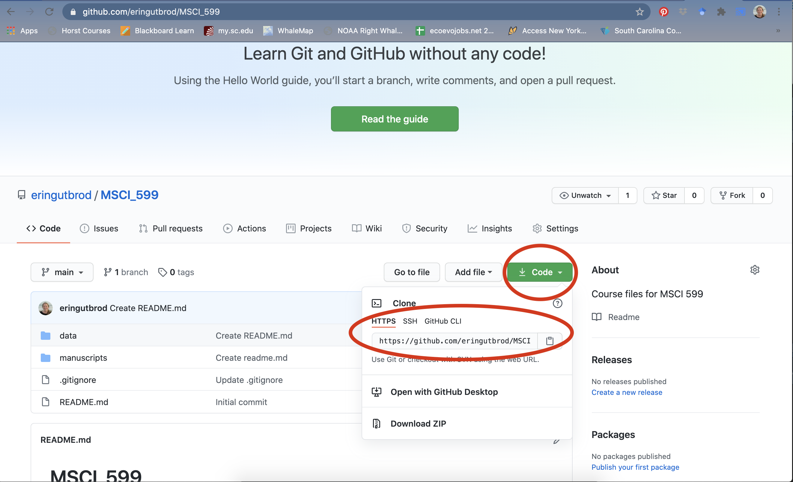
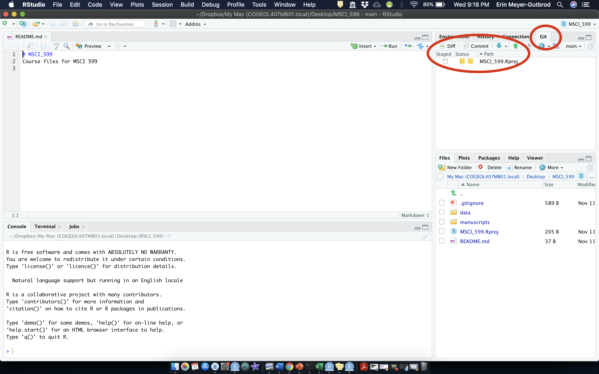

---
output:
  html_document: default
---

```{r setup, include=FALSE}
knitr::opts_chunk$set(fig.width=6, fig.asp = 0.618, collapse=TRUE) 
```

### Unit 1: Getting Started
#### Lesson 1: Introduction to Git and GitHub

***

### What is version control?

Version control allows you to keep track of your work and helps you to easily explore the changes you have made, be it data, coding scripts, notes, etc. You are probably already doing some type of version control, if you save multiple files, such as `Dissertation_script_25thFeb.R`, `Dissertation_script_26thFeb.R`, etc. This approach will leave you with tens or hundreds of similar files, making it rather cumbersome to directly compare different versions, and is not easy to share among collaborators. With version control software such as Git, version control is much smoother and easier to implement. Using an online platform like Github to store your files means that you have an online back up of your work, which is beneficial for both you and your collaborators.

Git has a tremendous amount of uses, and you can use the command line to perform advanced actions. However, in this class we will just be using Git's more basic functions. This is a gentle introduction to syncing RStudio and Github, so you can start using version control in minutes.

{width=40%}

### What are the benefits of using version control?

Having a GitHub repo makes it easy for you to keep track of collaborative and personal projects - all files necessary for certain analyses can be held together and people can add in their code, graphs, etc. as the projects develop. Each file on GitHub has a history, making it easy to explore the changes that occurred to it at different time points. You can review other people's code, add comments to certain lines or the overall document, and suggest changes. For collaborative projects, GitHub allows you to assign tasks to different users, making it clear who is responsible for which part of the analysis. You can also ask certain users to review your code. For personal projects, version control allows you to keep track of your work and easily navigate among the many versions of the files you create, whilst also maintaining an online backup.

### How to get started

First, please register on the Github website:

<https://github.com/>

The files you put on GitHub are public by default (i.e. everyone can see them & suggest changes, but only the people with access to the repository can directly edit and add/remove files). You can also have private repositories on GitHub, which means that only you can see the files. GitHub now offers free private repositories as standard with up to three collaborators per repository. They also offer a free education package, with access to software and other perks, you can apply for one using this link: https://education.github.com/discount_requests/student_application

### Download and install Git on your computer:

At the heart of GitHub is an open source version control system (VCS) called Git. Git is responsible for everything GitHub-related that happens locally on your computer. Git can be used through command line or through a downloaded GUI (Graphical User Interface) such as GitHub Desktop. However, in this class we'll be using RStudio's built-in integration with Git. 

Go here to download and install Git:
<https://git-scm.com/downloads>

#### For Windows machines:
Download and install Git for your operating system. Below are some recommended installation instructions, to keep things simple. However, if you know what these options do, and want to change them to suit you, go ahead:

* For "Select Components", check:
    + "Git Bash Here"
    + "Git GUI Here"
    + "Git LFS (Large File Support)"
    + "Associate .git* ..."
    + "Associate .sh ..."
* When prompted to choose the default editor, pick Nano (a simple terminal editor) or Notepad++ (a simple graphical editor):
* For "Adjust your PATH environment", select: "Use Git from Git Bash only"
* For "Choose HTTPS transport backend", select: "Use the OpenSSL library"
* For "Configure the line ending conversions", select: "Checkout Windows-style,..."
* For "Configure the terminal emulator ...", select: "Use MinTTY ..."
* For "Configure extra options", select: "Enable file system caching"
* "Enable Git Credential Manager"

#### For Mac machines:

Install Git via Homebrew, which is a package manager for command line programs on Mac. First, open a terminal, which can be found at `~/Application/Utilities/Terminal.app`. Then, copy and paste this line into the terminal and hit "Enter":

`/bin/bash -c "$(curl -fsSL https://raw.githubusercontent.com/Homebrew/install/master/install.sh)"`

When homebrew is finished installing, enter the following to install Git:

`brew install git`

Follow any instructions in the terminal window, you may need to enter your Mac's password or agree to questions by typing yes.

### Set Git email and username on your local computer

The first thing you must do when you install Git is to set your user name and email address. This is important because every Git commit uses this information, and it’s immutably baked into the commits you start creating. You only need to do this once if you pass the --global option, because then Git will always use that information for anything you do on that system. If you want to override this with a different name or email address for specific projects, you can run the command without the --global option when you’re in that project.

Do this by opening the shell on your computer. On a Mac computer, go to `Applications -> Utilities -> Terminal`. On a Windows machine, open up `Git Bash` (you can find it by going to your Start Menu and typing `Git Bash` into the search bar and clicking on it). Another way for Mac or Windows users to open their shell is through RStudio. In the lower-left hand pane, switch from the `Console` tab to the `Terminal` tab. This is equivalent to the Mac Terminal, and on Windows, once Git is installed, this should default to the Git Bash Shell.

Then, at the prompt in your shell, type in the following code. Note that `your_email@example.com` should be the email address that you used to set up your GitHub account. You can type in whatever you want between the quotation marks for `Your GitHub Username`, although I chose my actual GitHub username `eringutbrod` for simplicity.

**Copy the following code:**

```
git config --global user.email your_email@example.com
# Add the email with which you registered on GitHub and click Enter

git config --global user.name "Your GitHub Username"
# Add your username and click Enter
```

If you have a Windows computer, type the following to turn off this annoying feature where Windows can't handle filenames from git if there are too many characters in the filename:

```
git config --global core.longpaths true
```

That's it! If you are interested in double checking your `Git` settings, you can type in the following command into your shell:

```
$ git config --list
```

If you don't like your settings and want to change them, you can just repeat the commands above to update your email or your user name.

### The basics of version control with Git

#### What is a repository?
You can think of a repository (aka a repo) as a "master folder", everything associated with a specific project should be kept in a repo for that project. Repos can have folders within them, or just be separate files.

You will have a local copy (on your computer) and an online copy (on GitHub) of all the files in the repository.

#### The workflow
The GitHub workflow can be summarised by the "commit-pull-push" mantra.

1. Commit
    + Once you've created, deleted, or edited and saved files in your repo, you need to commit them - this means the changes you have made to files in your repo will be saved as a version of the repo, and your changes are now ready to be loaded onGitHub (the online copy of the repository).
2. Pull
    + Now, before you send your changes to Github, you need to pull, i.e. make sure you are completely up to date with the latest version of the online version of the files - other people could have been working on them even if you haven't.
3. Push
    + Once you are up to date, you can push your changes - at this point in time your local copy and the online copy of the files will be the same.

Each file on GitHub has a history, so instead of having many files like Dissertation_1st_May.R, Dissertation_2nd_May.R, you can have only one and by exploring its history, you can see what it looked at different points in time.

### Create your own repository and project folder structure

To make a repository, go to your Repositories page on your GitHub profile. Select `New`.... Repositories/New repository - choose a concise and informative name that has no spaces or funky characters in it. For today, a good name could be `hello_world`. Eventually you'll want to build a repo that holds together past and ongoing research, data, scripts, manuscripts for a specific project. Later on you might want to have more repositories - e.g. a repository associated with each project that you want version control for, or a public project where you are actively seeking feedback from a wider audience. 

Click the check boxes to Initialise repo with a README.md file and a .gitignore file. Add a .gitignore template. Search in the template options for the `R` template since we are primarily coding in R. Then click `Create Repository`. 

#### README file

It's common practice for each repository to have a README.md file, which contains information about the project, the purpose of the repository, as well as any comments on licensing and data sources. Github understands several text formats, including .txt and .md. .md stands for a file written in Markdown, which is essentially just the plain markup language that we use in RMarkdown files, except without the functionality to read R code. 

You can directly edit your README.md file on Github by clicking on the file and then selecting Edit this file. It's a good idea to write an informative README.md file for your repository. Just like with RMarkdown, to make headings and subheadings, put hashtags before a line of text - the more hashtags, the smaller the heading will appear. You can make lists using - and numbers 1, 2, 3, etc.. Here are some things you might want to consider including in a README file:

* Your name 
* Project title
* Links to website & social media
* Contact details

Go to the repository page for the repository you just made. Scroll down and you'll see your README.md file displayed at the bottom of the page. Click the pencil in the upper right-hand corner of the README file to edit the file directly on GitHub. Add your name, the date and a short description. When you are done, scroll to the bottom and click `Commit changes` to save the changes you made to the README file to the master branch of your repository.

#### Edit your .gitignore file

Repositories often have a file called `.gitignore`. The period at the beginning of the file name indicates that this will be a hidden file on your local computer. In this file you specify which files you want Git to ignore when users make changes and add files. So these are the kinds of files that you do NOT want to have stored on your GitHub repo. Examples include temporary Word, Excel and Powerpoint files, .Rproj files, .Rhist files, etc. Some files might get saved on your local repository (i.e. on your computer), but not online as they might be too big to store online.

We initialized the repo with a .gitignore file template designed for R programmers. If you didn't initialize the repo with a .gitignore file, you could oo to your repo and Create new file and write a .gitignore file within your main repository (not within any folders). You would need to call the file .gitignore and then add the types of files that Git should ignore on separate lines. 

Go to your repo and click on the .gitignore file and then click the edit pencil in the upper right-hand corner. You can keep the R template file exactly as it is, or you can make changes to the .gitignore file that are specific to your needs. This is what I've been using recently to exclude other types of files unrelated to R (such as temporary Microsoft Office files) that I might want to exclude from me repo. Feel free to copy and paste this into your own .gitignore file:

```
# Prevent users to commit their own RProject
.Rproj.user
.Rproj
# Prevent users to commit their own .RData and .Rhistory in mutual area
.RData
.Rhistory
.Rapp.history
# Temporary files
*~
~$*.doc*
~$*.xls*
*.xlk
~$*.ppt*
# Prevent mac users to commit .DS_Store files
*.DS_Store
# Prevent users to commit the README files created by RStudio
*README.html
*README_cache/
#*README_files/
```

You can go back to edit your .gitignore file by clicking on it in the repo and then clicking the edit button any time. After making edits, don't forget to commit them (save them) to your repo.

#### Create folders

Determine what your repository will contain - some examples include: manuscripts, data, figures, scripts, notes, etc. To make a new folder, go to your repo and click on `Add File -> Create new file` and add in the name of your new folder followed by a slash, e.g. `manuscripts/` before the name of the first file you want to put in the folder. It's always a good idea to create a README file, so you can call the file name `README.md` and then put some text in the Markdown file such as "The manuscripts folder contains article manuscripts, reports and presentations associated with this research". When creating folders within your repo through GitHub's website, you always need to make at least one file associated with them, you can't just create an empty folder, so the README file also serves this need. Add a brief explanation of what the folder is for in the README.md file, scroll down and click on the green `Commit new file` button. Add a quick message where it says Create README.md file in light grey text.

### Sync and interact with your repository through RStudio

The "commit-pull-push" workflow can be embedded within RStudio using "Projects" and enabling version control for them. On GitHub, navigate to the "hello_world" repository you just created.

Click the green download (indicated as an arrow pointing down) `Code` button and copy the HTTPS link:



Now open RStudio, click `File -> New Project -> Version control -> Git` and paste the HTTPS link from the Github repository into the `Repository URL:` field. Select a folder on your computer - that is where the "local" copy of your repository will be (whereas the online version of your repo is on Github).

Once the files have finished copying across (this may take a while depending on the size of the repo you're joining), you will notice that a few things about your RStudio session have changed: there is a `Git` tab in the top right corner of RStudio, and all the files that you created in your repo on GitHub are now on your local computer as well. We will use this `Git` tab to integrate our local files with our GitHub repository online.



You are now ready to start making changes and documenting them through Github! Note that you can't push empty folders.

You can open some of the files you made online earlier - for example if you click on your `README.md` file in the `Files` pane in the lower right corner of `RStudio`, you can make changes to the local copy on your computer. Add some more text, such as the date that you created this repo, just for the sake of exemplifying how version control works. Save the changes you made to your file in the usual way `File -> Save`. 

You can also create new files. Within `RStudio`, go to `File -> New file -> RMarkdown` and create a new file. I'm going to call mine "Hello Repository". Write a few words in your `.Rmd` file and perhaps a short R code chunk that creates and prints out a variable with "Hello repository" in it. Save your `.Rmd` file with any name you like (I chose `hello_repo.Rmd`).

Now we are going to get the changes you made on the local copy of your README file and your new `.Rmd` file synced up with the online copy on GitHub. You can do all of this through the `Git` pane in the upper right corner of RStudio. If you click on the `Git` tab you will see that now your `README.md` file is listed there. Add a check to the white box to the left of the README file under the `Staged` column. Now it has an `M` in the status box next to it - this means you have modified the file. Add a check in the white box next to the `hello_repo.Rmd` file. Now it has an `A` next to it, which means it's an added file. If we had deleted a file from the repo in our local directory, there would be a `D` next to it for a deleted file. If there are changes that you made in your local repo that you don't want to push out to the GitHub repo, just don't click on the box next to those files in the `Staged` column.

Once you have `Staged` the files that you want to commit to the GitHub repository, click on `Commit`. A window will pop up that shows the changes you made to the file(s). Additions are highlighted in green and deletions are highlighted in red. There is a box in the upper right hand corner where you must type out a `commit message`. You are required to include a commit message. Aim to be concise and informative in your commit message - what did you do? In my case, I edited the README file and created the hello_repo Rmd file. Once you have typed in your message and clicked on `Commit`, you will get a message about what changes you have made. You can close the message and the `Commit` pop-up window.

Note: If you want to commit all of your files at once and you don't want to go through and check (or uncheck) each box next to every single file, you can highlight the top file in the Git pane and hold `SHIFT` on your keyboard while you click on the bottom file . This will select all files at once. If you check one of the boxes now, the boxes next to all selected files will be checked. 

Once you click `Commit`, you will see a message saying that your branch is now one commit ahead of the `origin/master` branch - that is the branch that is on Github - we now need to let Github know about the changes we have made.

We can't repeat it enough: **always `Pull` before you `Push`.** `Pull` means that you are retrieving the most recent version of the Github repository onto your local branch - this command is especially useful if several people are working within the same repository - imagine there was another version of your R script because your collaborator was working on it the same time as you - you wouldn't want to "overwrite" their work and cause trouble. In this case, you are the only one working on these files, but it's still good to develop the practice of pulling before you push.

`Pull` the latest updates from the master branch on GitHub by clicking on the green downward-pointing arrow next to the `Commit` button in the `Git` pane in RStudio. A pop-up window will tell you that you are already up to date. Now you can `Push` the changes on your local computer out to your online GitHub account by clicking the green upward-pointing arrow in the `Git` pane in RStudio. Wait for the loading to be over and then click on `Close` - that was it, you have successfully pushed your work to Github!

Go back to your repository on Github, where you can now see all of your updated files online. Click on your README file on GitHub and then on `History` - this is where you can see the different versions of your script - obviously in real life situations you will make many changes as your work progresses - here we just have two. Thanks to Github and version control, you don't need to save hundreds of almost identical files (e.g. `Dissertation_script_25thFeb.R`, `Dissertation_script_26thFeb.R`) - you have one file and by clicking on the different commits, you can see what it looked like at different points in time.

**You are now ready to add your scripts, plots, data files, etc. to your new project directory and follow the same workflow as outlined above - stage your files, commit, pull, push.** If you have already created some files (scripts, documentation, etc.) for a new project repo, go ahead and copy them into your project folder that you tied to the repository on GitHub. Otherwise, start creating new files and write your code, produce figures, draft papers, etc. and make sure you are saving them in your project folder. Whenever a file is added to this folder or updated inside of this folder, you'll see it appear in your Git pane in the upper-right corner of RStudio. At reasonable intervals, or whenever you get something accomplished, make sure that you commit, pull and push those new files or new changes out to the master branch of your repository in GitHub.

#### XKCD on Git commit messages:

{width=40%}

### Using files on someone else's public GitHub

Now that you can create your own repository (project) from scratch on GitHub, it's time to learn how to use some of the data, models and materials that's already available in other peoples' repositories. You can grab someone else's GitHub repo, work with it in RStudio, and push it back onto GitHub.

Let's say you found some data/models/ etc. on GitHub that's part of a public repository owned by a person you don't know. That person has a public repo because they want people to have access to their model. It is useful to pull files from this existing repo into our own github profile. Then we can work with it in RStudio and send out our changes to our own copy of this repository on our own GitHub repository. 

This is especially relevant for our class, because **I have created tutorials and code for each of the class modules and hosted them in repositories on GitHub:** https://github.com/MSCI-599

This type of work flow requires the following steps:

-  FORK (or copy) an existing public repository to your own profile
-  CLONE your new online repository to your local computer
-  STAGE / COMMIT / PULL / PUSH your edits between the local and remote repos

This is just like the process we just did with our Hello world repo, except that we are FORKing an existing repository instead of creating one from scratch.

#### FORK

As you can imagine, people you don't know usually don't want you to be able to update their files without them knowing it. That's why you can't actually change a file in a 'master branch' unless you've been added as a collaborator by the "owner". So instead of using and changing their original files, you need to fork their repo first. This essentially makes a copy of all information in their repo, and stores it as your own.

Go to the course GitHub page https://github.com/MSCI-599 and Fork the first module `unit_1_getting_started` to your own GitHub profile:

-  Sign into github and search for msci 599 to find our course page 
   +  If you don't find it you may need to click "Search all of GitHub"
-  Click on the `unit_1_getting_started` repo
-  Press 'Fork' in the top right corner
-  Now navigate back to your github account (if you click on your user picture in the top right,
it'll bring down a menu where you can select "Your repositories"), and you'll see the forked repo exists in your world where you can mess with it

#### CLONE

Once you've forked a repo into your own github, you probably want to start working with it in RStudio. The easiest way is to get the repo URL from github, THEN create the corresponding project in RStudio that it'll communicate with. When you're in your forked repo that you want to work with:

-  Click on the green 'Code' button with the down arrow
-  Select and copy the entire URL (or click on the clipboard to the right of the URL)
-  Open a new RStudio session
-  Go to `File -> New Project -> Version Control -> Git` 
-  Paste the URL from github into the 'Repository URL' bar 
-  Make sure the project name is the same as the repo name and select the directory on your local computer where you want to save course files. 
-  Select `Open in a new session -> Create project!`

Now, it kind of seems like you're back to working in an RStudio project like normal, right? And all of the files that were in the repo you forked are now in your working directory. But we also have version control power now. 

Let's make changes to our own copy of this course repo. Remember the RMarkdown tutorial in the last class where you created an example `.Rmd` file? Or in the class before, did you create a `.R` script where you practiced making all of the different data types in R? Find those files on your computer and copy them over to your new `unit_1_getting_started` repo on your local computer. You might want to append your initials to the end of the file name so that you know that this is material that YOU created during the class. That way, you also don't copy over any of the files that I created for you in this repo. Or you can simply go into one of the files, such as `example_Rmd.Rmd` and make a change to it. Perhaps just add your initials to the top to say "EMG wuz here". Once you have made some changes to YOUR copy of the class repo, you want to save those changes and push them back out to GitHub. These changes will only exist in the forked version of this repo in your GitHub profile. Your edits will not be saved in the original class version of this repository.

#### STAGE / COMMIT / PULL / PUSH

Now that your project in RStudio has been updated,we follow the process of Stage > Commit > Pull > Push to send versions back to github. Once you've saved your .Rmd (feel free to knit, too), it shows up in your working directory. This process is exactly the same as what you did earlier when you created your own repo from scratch.

-  Click on the 'Git' tab in the upper-right corner of RStudio
-  Select files waiting to be committed (stage all of them)
-  Click 'Commit'
-  Add a short commit message (required), then press 'Commit'
-  Click 'Pull' - the blue 'DOWN' icon - to make sure no other collaborators have added something to this repo (they didn't because this repo doesn't have any other collaborators)
-  Click 'Push' - the green 'UP' icon - to send the commits back to github
-  Refresh your GitHub repo online, and see that the file(s) YOU created now exist in your repo. Cool!
Cloud storage and version control!

## Course Workflow

Now that you are set up with GitHub and you have found our class GitHub repository: https://github.com/MSCI-599 you can follow the class coding tutorials very easily. Whenever we start a new unit, y**ou should fork the associated unit repo to your own GitHub profile and Clone it onto your local computer.** From there you have access to all of the files we use in the tutorial: data, scripts, figures, readings etc. During class, create your own `.R` or `.Rmd` file and type the code along with me, but save the file with your initials at the end of the file name. That way you know that it's the versions that YOU created while you were following along with the course. You can take your own notes / comments directly in your `.R` or `.Rmd` files and reference them later. You'll also have the original tutorials that I created for you to reference as well. Commit and push your changes back into your repo as you go.

When you are working, open up the `.Rmd` file associated with the lesson tutorial that we are working through that day. Also open a new `.Rmd` or `.R` file in the RStudio Project linked to that unit's repo on your computer to type the code we are writing along with the tutorial. You can toggle between the RStudio script that you are writing in RStudio and the typed-up tutorial that you knitted from the `.Rmd` file I created.

## Course homework workflow

I will send out a homework assignment URL for each assignment through GitHub Classroom. This will create a private repository that is just for your homework assignment where you can clone your private homework repo to your local computer, build your scripts / files, commit (save) your work, and push it back to your private homework repo that I have access to for grading. The first time you accept a homework assignment for this class, you'll receive a request to link your GitHub account to your name/email/student ID (I haven't decided which) to the class roster. This is important because that's how I'll know how to relate the completed homework files to the student that submitted them. Once you have accepted your assignment (and once you have linked your GitHub account to your identifier) you'll interact with the homework template like a normal GitHub repository. Make changes to the file(s), add files and add data as needed to complete the assignment, then push your changes back out to GitHub through RStudio before the deadline. Voila!

### Potential problems

Sometimes you will see error messages as you try to commit-pull-push. Usually the error message identifies the problem and which file it's associated with, if the message is more obscure, googling it is a good step towards solving the problem. Here are some potential problems that might arise:

#### Code conflicts

While you were working on a certain part of a script, someone else was working on it, too. When you go through commit-pull-push, GitHub will make you decide which version you want to keep. This is called a code conflict, and you can't proceed until you've resolved it. You will see arrows looking like `>>>>>>>>>` around the two versions of the code - delete the version of the code you don't want to keep, as well as the arrows, and your conflict should disappear.

#### Pushing the wrong files

If you accidentally push what you didn't intend to, deleted many things (or everything!) and then pushed empty folders, you can revert your commit. You can keep reverting until you reach the point in time when everything was okay. This is an easy way out if you're the only person working in the repository - __be aware that if there are other people that have committed to the repository, reverting will also undo all of their work, as reverting refers to the repository as a whole, not just your own work in it.__

Using these "undo" commands can be daunting, so make sure you read up on the different commands before you attempt anything that may delete work permanently: [here's a starter](https://www.atlassian.com/git/tutorials/undoing-changes/git-revert). It's a good idea to regularly back up your repository to an external hard drive _juuuust_ in case!  

### Collaborative coding in GitHub

So far, we've been the sole "author" on some repo/project we're working in. Often, we'll want to be collaborating on a paper or data analysis work. If that's the case, we'll want to add a collaborator.

**IMPORTANT: Collaborators will be able to push/pull changes directly to/from the repo you share with them, so make sure it's someone you want to allow!**

Once you have confirmed that you want to add someone as a collaborator:

-  Figure out what name or username or email they have associated with their github account
-  While in the github repo that you want to add them to as a collaborator, click on 'Settings' 
-  In the left-hand menu, click 'Manage Aaccess'
-  In the center of the page, click 'Invite Collaborators'
-  Enter their name(s) (any of the above to search)
-  When you find the right one, click 'Add Collaborator'

Now your invited collaborators can clone and push/pull directly to this repository, and you can both work on the same
project simultaneously.

***

### For more information

Here is a great reference guide for using Git and GitHub as an R programmer:

"Happy Git and GitHub for the useR" by Jenny Bryan and Jim Hester: https://happygitwithr.com/

Specifically, if you are having trouble linking Git up with RStudio, look here:
https://happygitwithr.com/rstudio-see-git.html#rstudio-see-git

Great resource for common Git problems (requires command line interface):
https://ohshitgit.com/

#### Sync and interact with your repository through the command line

Traditionally, Git uses the command line to perform actions on local Git repositories. In this class we don't use the command line but it is necessary if you want more control over Git. There are several excellent introductory guides on version control using Git, e.g. [Prof Simon Mudd's Numeracy, Modelling and Data management guide](http://simon-m-mudd.github.io/NMDM_book/#_version_control_with_git), [The Software Carpentry guide](https://swcarpentry.github.io/git-novice/), and this [guide from the British Ecological Society Version Control workshop](https://github.com/BES2016Workshop/version-control). For more generic command line tools, look at this [general cheat sheet](https://www.git-tower.com/blog/command-line-cheat-sheet) and this [cheat sheet for mac users](https://github.com/0nn0/terminal-mac-cheatsheet). Here is a table and flow diagram with some basic Git commands and how they fit into the Git/Github workflow:


<table>
  <tr>
    <th>Command</th>
    <th>Origin</th>
    <th>Destination</th>
    <th>Description</th>
  </tr>
  <tr>
    <td><code>git clone REPO_URL</code></td>
    <td>Personal Github</td>
    <td>Local</td>
    <td>Creates a local copy of a Github repo. The URL can be copied from Github.com by clicking the `Clone or Download` button.</td>
  </tr>
  <tr>
    <td><code>git add README.md</code></td>
    <td>Working Dir</td>
    <td>Staging Area</td>
    <td>Add "README.md" to staging area.</td>
  </tr>
  <tr>
    <td><code>git commit</code></td>
    <td>Staging Area</td>
    <td>Local</td>
    <td>Commits changes to files to the local repo.</td>
  </tr>
  <tr>
    <td><code>git commit -a</code></td>
    <td>Working Dir</td>
    <td>Local</td>
    <td>adds and commits all file changes to the local repo.</td>
  </tr>
  <tr>
    <td><code>git pull</code></td>
    <td>Personal Github</td>
    <td>Local</td>
    <td>Retrieve any changes from a Github repo.</td>
  </tr>
  <tr>
    <td><code>git push</code></td>
    <td>Local</td>
    <td>Personal Github</td>
    <td>Sends commited file changes to Github repo.</td>
  </tr>
  <tr>
    <td><code>git merge</code></td>
    <td>Other branch</td>
    <td>Current branch</td>
    <td>Merge any changes in the named branch with the current branch.</td>
  </tr>
  <tr>
    <td><code>git checkout -b patch1</code></td>
    <td>NA</td>
    <td>NA</td>
    <td>Create a branch called "patch1" from the current branch and switch to it.</td>
  </tr>
  <tr>
    <td><code>git init</code></td>
    <td>NA</td>
    <td>NA</td>
    <td>Initialise a directory as a Git repo.</td>
  </tr>
  <tr>
    <td><code>git log</code></td>
    <td>NA</td>
    <td>NA</td>
    <td>Display the commit history for the current repo</td>
  </tr>
  <tr>
    <td><code>git status</code></td>
    <td>NA</td>
    <td>NA</td>
    <td>See which files are staged/unstaged/changed</td>
  </tr>
  <tr>
    <td><code>git diff</code></td>
    <td>NA</td>
    <td>NA</td>
    <td>See the difference between staged uncomitted changes and the most recent commit</td>
  </tr>
  <tr>
    <td><code>git stash</code></td>
    <td>NA</td>
    <td>NA</td>
    <td>Save uncommitted changes in a temporary version and revert to the most recent commit</td>
  </tr>
</table>

#### Acknowledgements

Some of the material for this tutorial was adapted from the following:

Our Coding Club
https://github.com/ourcodingclub/ourcodingclub.github.io/blob/master/_tutorials/git.md

Dr. Allison Horst's ESM 206 course
https://github.com/allisonhorst/esm-206-2018
